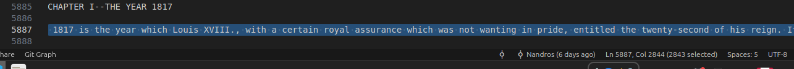

# CPP TP1 Jack Nathan

## Build

Create build dir
```bash
mkdir build
```

Compile
```bash
cmake -Bbuild
cmake --build build/
```

Run
```bash
./build/CPP_TP1_JAK_NAT
```

### Lecutre par lignes

Le buffer doit pouvoir acceuillir la ligne entière. Il doit donc avoir une taille maximale qui ocrrespond à la ligne la plus grande du fichier.  
Ici le buffer doit faire 2850 environ.
