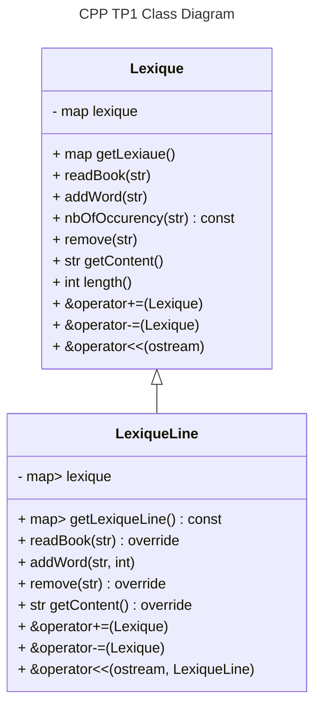

# CPP TP1 Jack Nathan

## Build

Create build dir
```bash
mkdir build
```

Compile
```bash
cmake -Bbuild
cmake --build build/
```

Run
```bash
./build/CPP_TP1_JAK_NAT
```

## UML


```mermaid
---
title: CPP TP1 Class Diagram
---
classDiagram
    Lexique <|-- LexiqueLine

    class Lexique{
        - map<str, int> lexique

        + map<str, int> getLexiaue()
        + readBook(str)
        + addWord(str)
        + nbOfOccurency(str) const
        + remove(str)
        + str getContent()
        + int length()
        + &operator+=(Lexique)
        + &operator-=(Lexique)
        + &operator<<(ostream)
    }
    class LexiqueLine{
        - map<str, vector<int>> lexique

        + map<str, vector<int>> getLexiqueLine() const
        + readBook(str) override
        + addWord(str, int)
        + remove(str) override
        + str getContent() override
        + &operator+=(Lexique)
        + &operator-=(Lexique)
        + &operator<<(ostream, LexiqueLine)
    }
```

